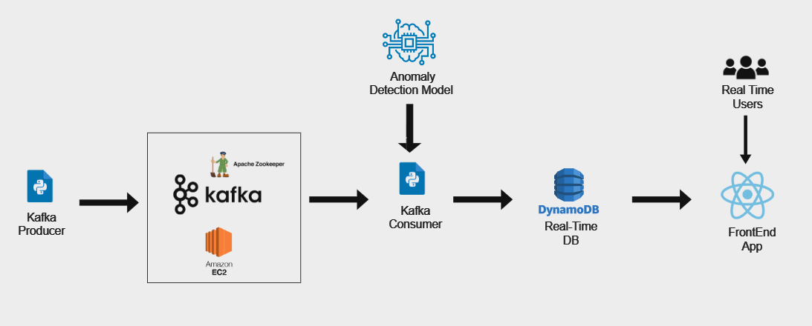

# Real-Time Anomaly Detection System

This project implements a real-time Credit Card anomaly detection system using Kafka for data streaming, an Isolation Forest machine learning model for anomaly detection, and DynamoDB for real-time data storage. The frontend application, built with React, displays the processed data to real-time users.

## Architecture Image



## Architecture Overview

The system is designed to handle real-time data ingestion, processing, and anomaly detection using the following components:

- **Kafka Producer**: A Python-based producer that sends data streams to Kafka. This is the entry point for data ingestion, producing real-time data to be processed.
  
- **Kafka**: A distributed streaming platform running on Apache Zookeeper and hosted on AWS EC2. Kafka serves as the data pipeline to hundle real-time data streams.

- **Kafka Consumer**: A Python-based consumer that pulls data from Kafka topic (Topic4CreditCard) and passes it to the anomaly detection model for processing.

- **Anomaly Detection Model**: The anomaly detection is performed using the Isolation Forest model, which is specifically designed to detect anomalies or outliers in the data stream.

- **DynamoDB**: A real-time NoSQL database hosted on AWS. The detected anomalies (and non-anomalous data) are stored here for further processing and visualization.

- **React Frontend**: A simple user interface that allows real-time users to view the status of transactions. The frontend fetches the stored data from DynamoDB and displays whether a transaction has been flagged as fraudulent or not based on the anomaly detection model.


## System Flow

1. **Data Ingestion**: A Kafka producer continuously sends data streams to Kafka topic.
2. **Kafka Message Queue**: Kafka manages and brokers the data stream, ensuring reliable and scalable message delivery to consumers.
3. **Anomaly Detection**: A Kafka consumer pulls the data, which is then fed into the Isolation Forest model to detect anomalies in real time.
4. **Data Storage**: The results (anomalies and non-anomalous data) are stored in DynamoDB for further retrieval and analysis.
5. **Frontend Display**: The frontend app queries DynamoDB to present the data to real-time users, highlighting detected anomalies.

## Installation

### Prerequisites

- **Kafka and Zookeeper**: Ensure you have Kafka and Zookeeper installed and running in a EC2 instance (it''s possible  to run it  localy or in docker container).
- **Python 3.x**: Required for the Kafka producer, consumer, and the anomaly detection model.
- **Node.js**: Required to run the React frontend.
- **AWS DynamoDB**: An AWS account and DynamoDB setup are required for data storage.

### Clone the Repository

To get started, clone the repository to your local machine:

```
    git clone https://github.com/ELhadratiOth/Real-Time-CreditCard-fraudDetection
```
### Kafka Setup

1. Install Kafka and Zookeeper:
   ```
   check this file  : /Kafka Config/config.txt
   ```
2. Install the required packages for the producer, consumer , and ML model :
   ```
   pip install kafka-python boto3 scikit-learn pandas

   ```
2. DynamoDB Setup :
```
    . Ensure that DynamoDB is set up in AWS and accessible.
    . Update the Python scripts to include your AWS credentials (aws CLI in you're local machine) and DynamoDB table should be : "FraudDetection".
```
4. React Frontend Setup :
   ```
    cd frontend
    npm install
    npm start

   ```


  
